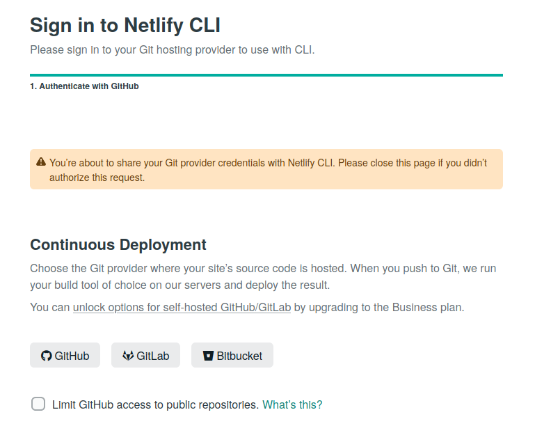
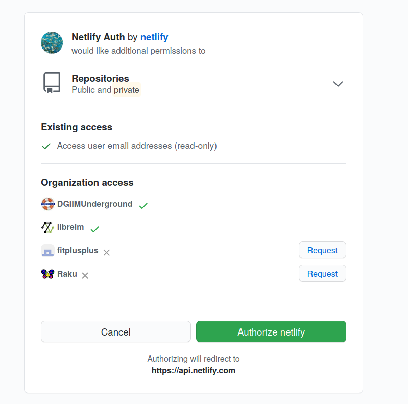
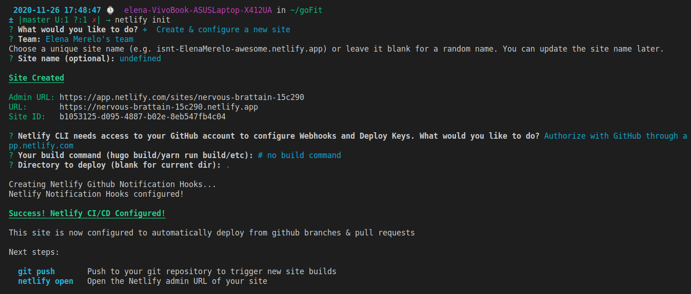
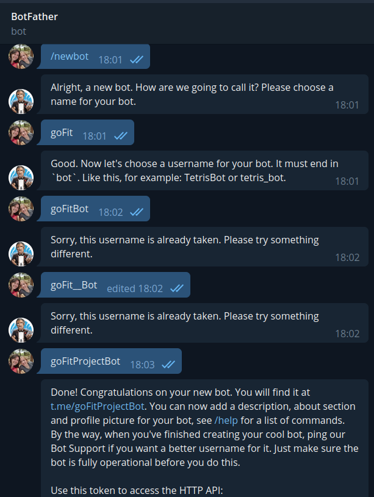
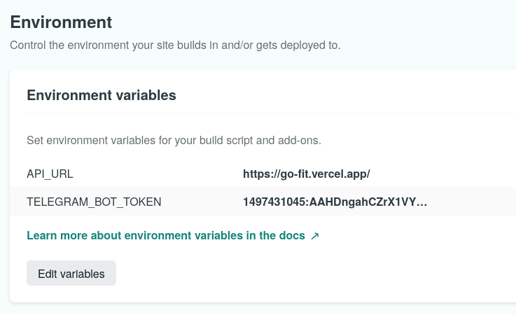
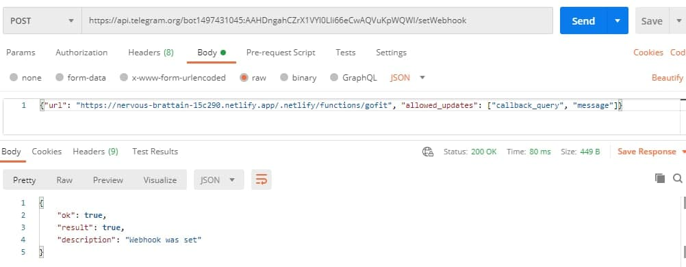

# Bot

Voy a crear un bot de telegram que me permita consultar los workouts en un chat. Este bot lo voy a desplegar en Netlify. 

## Configuración de Netlify 

Ya tenía Netlify instalado, podemos consultar cómo lo hice [aquí](https://github.com/ElenaMerelo/iv-autoevaluacion#hito-5). Lo único que queda es conectarlo con el repositorio. Se hace de manera sencilla, como podemos ver en las fotos:

Tenemos que crear un archivo [netlify.toml](../netlify.toml) indicando dónde se encuentran nuestras funciones: 

~~~toml 
[build]

  functions = "./functions"
~~~ 

Creamos [la función del webhook](../functions/gofit.js). Vamos a usar Telegraf, para lo que lo instalamos con `npm i telegraf`. Para crear el bot en sí, empezamos una conversación con el BotFather: 

Añado el token que me devuelve a `environment variables`:

Ahora tenemos que decirle al bot de telegram dónde está nuestro webhook, para lo que usamos una petición `POST` usando Postman (el webhook está desplegado en la siguiente dirección: https://nervous-brattain-15c290.netlify.app/.netlify/functions/gofit):

Ya solo quedaría crear algunos comandos para el bot en el archivo [gofit.js](../functions/gofit.js). He creado dos:

- Uno para detectar si el comando pasado no se reconoce, en cuyo caso respondo con `No entiendo na.`.
- Otro para consultar los ejercicios con el formato `/workout <intensity> <muscle-group> <disciplines> <duration>`.