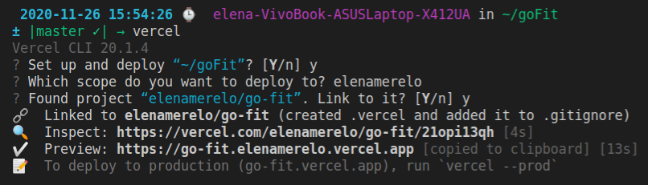

# Configuración de Vercel 

## Cuenta e instalación 

Se puede consultar cómo lo hice en los [ejercicios de autoevaluación](https://github.com/ElenaMerelo/iv-autoevaluacion#hito-5).

Con el comando `vercel`  linkeamos nuestro proyecto:

## API 

Como se puede ver en [la documentación](https://vercel.com/docs/runtimes#official-runtimes/node-js), Vercel soporta de forma nativa `node`. Además, por defecto se utiliza la última versión LTS, luego no tenemos no que hacer ninguna configuración adicional (para más información, [pinchar aquí](https://vercel.com/docs/runtimes#official-runtimes/node-js/node-js-version)).

Por las razones expuestas, no vamos a crear ningún archivo `vercel.json`, no hace falta.

Creamos el directorio `api` y ahí hacemos nuestra función `gofit`, creando un fichero [gofit.js](../api/gofit.js). Dado que uso `express`, [vercel me permite](https://vercel.com/guides/using-express-with-vercel) reusar mi objeto `app`, que ya tiene todas las rutas de la API definidas. La función quedaría pues así de simple:

~~~javascript
import app from 'src/workout_factory/app.js';

module.exports = app;
~~~

El único problema es que las rutas definidas en `app` empiezan desde `/`, y las de nuestra función de Vercel empiezan en `/api/`. Consecuentemente, al final si que tenemos que hacer un `vercel.json` reenrutando las peticiones que lleguen a nuestra api:

~~~json
{
  "rewrites": [{ "source": "/api/(.*)", "destination": "/api" }]
}
~~~
